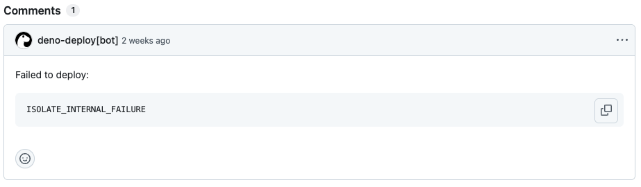
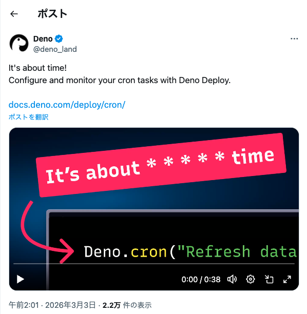

# Deno Deploy で沼った話

Discord bot の deploy 試行錯誤

---

## 自己紹介

<style scoped>
img[alt="profile"] {
  width: 300px;
  border-radius: 50%;
  position: absolute;
  right: 100px;
  top: 200px;
}
</style>


### 河野 裕隆（ [@hk_it7](https://x.com/hk_it7) ）
- 虎の穴ラボ 通販エンジニア、チームリーダー
- **東葛.dev 主催者**
- きのこカンファレンス 2026 コアスタッフ

---

## 作ったもの

地域コミュニティのコミュニケーション活性化のため、Discord bot を Deno Deploy（classic） で運用している

### bot が送る通知

- Spotify プレイリストの更新情報
- ランダム話題提供（日本語版・英語版）
- アクティブな募集掲示板情報

### ポイント

`Deno.cron()` のみで動作 — **HTTP エンドポイントは持たない**

---

## 問題：PR を出すたびにエラーが出る

git integration（auto deploy）を使っていると、**PR ごとに preview deployment が走る**

```
Crons are not supported for preview deployments.
Cron jobs will not be executed in this context.
```

- `Deno.cron()` を含むコードを preview にデプロイ → `ISOLATE_INTERNAL_FAILURE`
- PR のチェック欄に **`@deno-deploy — Failed to deploy`** が常に出る

bot なので preview deployment は完全に不要...



---

## 対応方針：GitHub Actions に移行

Deno Deploy の設定を見ても、git integration のまま preview を無効にする方法がない

→ **GitHub Actions に移行**して production のみデプロイする

```
Before: GitHub push → Deno Deploy auto deploy（preview含む）

After:  push to main → GitHub Actions → Deno Deploy（production のみ）
```

---

## 試行錯誤①：`denoland/deployctl` Action

```yaml
- uses: denoland/deployctl@v1
  with:
    project: my-project
    token: ${{ secrets.DENO_DEPLOY_TOKEN }}  # 渡したい
```

**失敗** — v1.13.1 は OIDC 専用の設計、`token` を `with:` で渡せない

git integration を解除すると OIDC も使えなくなるので詰み

```
Error: Failed to get the GitHub OIDC token.
```

---

## 試行錯誤②：`deployctl` CLI を直接 `deno run`

Action のラッパーを使わず CLI を直接呼ぶ。`DENO_DEPLOY_TOKEN` を env で渡せばトークン認証できる

```yaml
- run: deno run -Ar jsr:@deno/deployctl deploy \
    --project=<project-name> main.ts
  env:
    DENO_DEPLOY_TOKEN: ${{ secrets.DENO_DEPLOY_TOKEN }}
```

→ デプロイ自体は成功
→ しかし **`--prod` フラグなし = preview として deploy**
→ 同じエラーが発生...

---

## 解決：`--prod` フラグを追加

```yaml
name: Deploy
on:
  push:
    branches:
      - main
jobs:
  deploy:
    runs-on: ubuntu-latest
    steps:
      - uses: actions/checkout@v4
      - uses: denoland/setup-deno@v2
        with:
          deno-version: v2.x
      - name: Deploy to Deno Deploy
        run: deno run -Ar jsr:@deno/deployctl deploy \
          --project=<project-name> --prod main.ts
        env:
          DENO_DEPLOY_TOKEN: ${{ secrets.DENO_DEPLOY_TOKEN }}
```

---

## Before / After

| | auto deploy (before) | GitHub Actions (after) |
|---|---|---|
| PR 時の挙動 | preview deploy が走る | 何も起きない |
| main マージ時 | production deploy | GitHub Actions 経由で production deploy |
| PR チェック | `@deno-deploy Failed` が出る | 出ない |

これで解決！ ...と思っていたら

---

## 新たな問題：preview との2重起動疑惑

GitHub Actions 移行後もcronが **preview mode で動いているような挙動** が続く

Deno KV に `is_preview` フラグを持たせて実験
→ やはり **preview っぽい環境で動作** していることが示唆された

---

## さらに：新機能が production に反映されていない

- 追加した新しい cron が一向に動かない
- `--prod` フラグつきでデプロイしたはずなのに...

試しに **git integration に戻したところ**
→ 新機能分の cron が **未実行状態に戻る**

**仮説：GitHub Actions 期間中は preview インスタンスで動いており、
production 側は実は古いコードのままだったのでは？**

---

## git integration に戻した

Deno Deploy の内部挙動はブラックボックスが多く、これ以上の調査が困難

- `--prod` フラグをつけていても、**実際に production として動作しているかは Deno Deploy 側の挙動に依存**
- cron の実行状況を直接確認できる手段が限られており、問題の切り分けが難しい

→ **git integration に戻すことにした**

---

## 教訓

cron 駆動・HTTP エンドポイントなしの bot は、
**preview deployment との相性がそもそも悪い**？

Deno Deploy で bot を運用するなら
**preview deployment を完全に無効化できるかを事前に確認**すべきだった

---

## 結局どうしたか

根本解決は諦めて、**エラーにならないようにダミーのエンドポイントを追加した**

```typescript
// main.ts の末尾に追加
Deno.serve(() => new Response("NOT FOUND", { status: 404 }));
```

1行で解決

---

## `Deno.cron()` おすすめです

- **サーバーレスで定期実行**が完結する手軽さ
- 外部のスケジューラ（GitHub Actions cron 等）が不要
- Deno KV と組み合わせれば**状態管理も Deno だけで完結**

bot に限らず、定期的なデータ取得・通知・集計などに便利

| サービス | 定期実行 | 設定方法 | 無料枠 |
|---|---|---|---|
| Deno Deploy | `Deno.cron()` | コード内 | あり |
| Cloudflare Workers | Cron Triggers | `wrangler.toml` | あり（3つまで） |
| Vercel | Cron Jobs | `vercel.json` | 1日1回 |
| Netlify | Scheduled Functions | コード内 | あり |

---

## 新しい Deno Deploy でも Cron 対応予定

Deno 公式から、新しい Deno Deploy（次世代版）でも
**`Deno.cron()` のサポートが予定されている**と発表あり

今回の沼は classic 固有の問題である可能性も高いので、
今後はよりスムーズに使えるようになることに期待！


<style scoped>
img[alt="deno-cron-announcement"] {
  width: 350px;
  position: absolute;
  right: 100px;
  top: 200px;
}
</style>



---

## 参考

- [Denoで作る！DiscordへのSpotifyプレイリスト楽曲追加通知【完全無料】](https://qiita.com/hk_it7/items/54745bdb33cd534a63ec)
- [Deno Deploy の auto deploy を GitHub Actions に移行した](https://kouno-log.pages.dev/memos/deno-deploy-github-actions/)
- [Deno Deploy を git integration に戻した](https://kouno-log.pages.dev/memos/deno-deploy-back-to-git-integration/)

---

# 根本解決の方法をご存知の方、ぜひ教えてください！

- cliで`--prod` フラグつきでデプロイしたのに本番反映されていない
- cronのみの場合、previewのdeployを走らせない方法